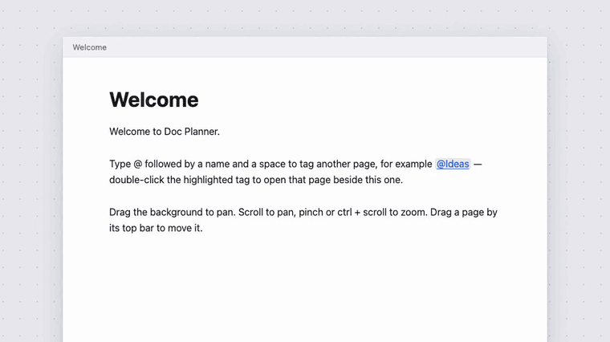

# Doc Planner

**A spatial canvas for writing connected documents.** Write on A4 pages, tag other pages with `@Name`, and double-click a tag to open that page beside the current one, joined by an arrow.

<p align="center">
  
</p>

Built with [Vite](https://vite.dev) and vanilla TypeScript. No framework, no runtime dependencies.

## Highlights

- **Linked pages**: `@Name` tags are highlighted like links; double-click one to open the page it points at, with an arrow drawn from the mention to the page.
- **Infinite canvas**: pan and zoom over everything using CSS 3D transforms.
- **Local-first**: your work autosaves in the browser and is there when you come back.
- **Agent-friendly**: copy the whole workspace to the clipboard in one click.

## Features

### Writing

- A4 pages that flow onto further sheets, with a page counter
- Typing `@` opens fuzzy-searched suggestions, closest match first
  - <kbd>↑</kbd> <kbd>↓</kbd> to move, <kbd>Enter</kbd> or <kbd>Tab</kbd> to accept, <kbd>Esc</kbd> to dismiss
- **Fit contents**: pages shrink to their text (up to one A4 sheet); toggle back with Display as A4

### Navigating

| Action | How |
| --- | --- |
| Pan | Drag the background, or scroll |
| Pan over a page | Press <kbd>Space</kbd> and drag within 500ms |
| Zoom | Pinch, <kbd>Ctrl</kbd>/<kbd>Cmd</kbd> + scroll, or the − / + buttons |
| Reset view | Reset Camera |
| Open / close everything | Expand All / Contract All |

### Saving and sharing

| Action | How |
| --- | --- |
| Autosave | Automatic; the working copy lives in IndexedDB and resumes on your next visit |
| Named saves | Save (<kbd>Ctrl</kbd>/<kbd>Cmd</kbd>+<kbd>S</kbd>), Save as… (<kbd>Ctrl</kbd>/<kbd>Cmd</kbd>+<kbd>Shift</kbd>+<kbd>S</kbd>), Load |
| Export / Import | Download the workspace as a JSON file, or open one; you can also drop a file anywhere on the page |
| Copy for Agent | Copies the pages and relationships to the clipboard, ready to paste into an AI assistant |

Workspaces are stored as flat JSON documents with a separate relationships list, and saves and exported files share the same format.

## Getting started

```sh
npm install
npm run dev       # start the dev server
npm run build     # type-check and build to dist/
npm run preview   # serve the production build locally
```

## Project layout

| File | Purpose |
| --- | --- |
| `src/main.ts` | App shell, toolbar, save/import/export wiring |
| `src/editor.ts` | Page editing and rendering |
| `src/autocomplete.ts`, `src/fuzzy.ts` | `@` suggestions and fuzzy matching |
| `src/links.ts` | Arrows between mentions and pages |
| `src/viewport.ts` | Pan and zoom camera |
| `src/model.ts` | Workspace data model and (de)serialization |
| `src/storage.ts`, `src/saves-dialog.ts` | IndexedDB persistence and the save/load dialogs |

## Deployment

Coolify builds the `Dockerfile` (Vite build served by nginx). Bunny CDN sits in front as a pull zone so most requests never reach the VPS.

- `nginx.conf` sends `Cache-Control: public, max-age=31536000, immutable` for the fingerprinted files in `/assets/`, and `no-cache` for `index.html` so a new deploy is picked up straight away.
- Bunny pull zone: set the origin URL to the Coolify domain, leave caching on "Respect origin Cache-Control" (the default), and point the app's domain at the pull zone with a CNAME.
- No purge is needed after a deploy, since new builds produce new asset names and `index.html` is always revalidated.
